# 在线商城 · 独立服务站

**一套零依赖、单目录部署的自助下单商城系统（PHP + SQLite）**

> ✅ **独立部署** — 上传即用，不需要数据库、不需要框架，NAS / 虚拟主机 / VPS 都能跑<br>
> ✅ **可集成** — 放进任何 PHP 网站的子目录即可运行，也可将模块整合进现有系统<br>
> ✅ **可二次开发** — 原生 PHP + 零依赖 + MIT 协议，改造成本极低


---

## 📖 项目介绍

在线商城 · 独立服务站是一套面向**个人服务者与小微团队**的「自助下单 + 订单管理」系统。
它把 **客户选服务 → 下单 → 扫码付款 → 你核对到账 → 交付** 这条完整链路做成一个网站：
客户**无需注册**即可下单、查询进度；你只需要一个 PHP 空间，几分钟就能开业。

系统采用**单目录结构、零外部依赖**设计：不依赖框架、不需要 Composer / Node、
不需要 MySQL 等数据库服务（订单存本地 SQLite 文件），
因此既能**独立部署**，也能**作为子目录放进任何现有 PHP 网站**运行，
还适合作为**二次开发底座**，改造成属于你自己的业务系统。

### 🎯 适用场景

- 🖥 电脑技术服务 / 远程维修接单（装机、重装系统、优化加速、清灰维修…）
- 💾 虚拟商品 / 软件资源 / 素材包销售
- 📅 预约类服务（到店维修、上门服务、指定时间交付）
- 🎓 培训咨询 / 工作室课程报名与收款
- 🛠 任何「先收款后交付」的小微生意与个人业务

### 🧩 三种使用方式（多用型）

| 方式 | 说明 |
|---|---|
| **① 独立部署** | 整个目录上传到任意 PHP 空间，绑定域名或子目录即可开业 |
| **② 集成进现有网站** | 放进你现有 PHP 站点的任意子目录就能跑；也可以在保持零依赖的前提下，把「下单 / 订单 / 推送」等模块整合进已有系统 |
| **③ 二次开发底座** | 原生 PHP + SQLite + MIT 协议：加字段、加流程、换 UI、对接自有通知渠道都容易 |

### 💡 为什么适合二次开发

- **纯原生 PHP，无框架**：没有框架学习成本，任何 PHP 开发者都能直接上手改
- **零依赖**：不需要 Composer / Node / MySQL，不存在依赖冲突与部署环境地狱
- **分层清晰**：数据（`inc/shop_store.php`）、推送（`inc/push.php`）、后台视图（`inc/admin_view.php`）职责分明
- **数据自控**：SQLite 单文件 + AES 加密配置，备份 / 迁移只需要拷贝目录
- **MIT 协议**：允许自由修改、商用与分发

---

## ✨ 功能特性

### 前台（客户侧）

- 🛍 **分类 + 商品展示**：分类卡片、商品列表、价格、标签、图标，支持搜索
- 🧾 **多选下单**：一次勾选多件商品合并下单，单商品也可直接下单
- 📝 **下单表单可配置**：微信 / 电话 / 预约时间 / 备注，必填项后台开关控制
- 💰 **收款码收款**：聚合码（一码收款）或 微信 / 支付宝 分开收款，两种模式
- 🔖 **自动备注码**：每单生成唯一备注码（如 EK），对账不混淆，支持客户自助更换
- 🔍 **订单查询**：客户凭手机号 / 微信号自助查询进度，无需注册登录
- 🌙 **深色主题 + 响应式**：手机 / 平板 / 电脑都可用

### 后台（管理侧）

- 📊 **订单管理**：状态流转（待付款 → 待人工核查 → 已确认付款 → 处理中 → 已完成 / 已失效 / 已取消）、订单详情、CSV 导出
- 📦 **商品 / 分类管理**：排序、图标、标签、库存、价格、上架 / 下架，全可视化维护
- 💳 **收款与表单**：收款码、收款人名称、付款提示语、表单必填项、查询页开关
- 🔔 **消息推送**：新订单和客户标记已付款实时推送到手机；支持 **Gotify / ntfy / 邮件 SMTP / 通用 Webhook** 四通道，带失败重试队列与一键测试
- 🛡 **风控与清理**：IP 限流、提交蜜罐、同 IP 未付款订单上限、未付款订单自动失效、已失效订单保留策略
- 📋 **操作审计日志**：订单变更 / 登录 / 配置修改全程留痕（操作人 + IP）
- 📖 **内置使用说明**：后台自带「三步跑起来」向导
- 🎨 **明暗主题一键切换**

### 安全设计

- 🔐 商品配置 AES-256 加密存储，密钥独立目录保管
- 🚦 接口限流 + 同源校验 + 蜜罐字段，防刷单、防脚本
- 🧱 自带 Web 防护规则：data / secret / inc / cron 目录禁止直接访问
- 👤 后台账号 + CSRF 双重校验；默认密码未修改时持续提醒
- 📦 订单数据为本地 SQLite 文件，数据完全自己掌控

---

## 🖼 界面预览

### 前台

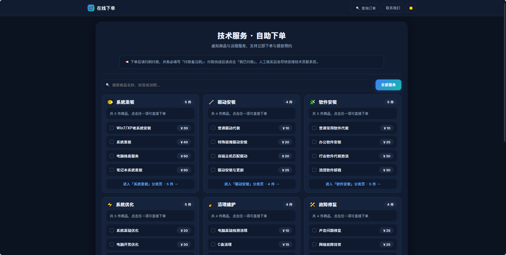

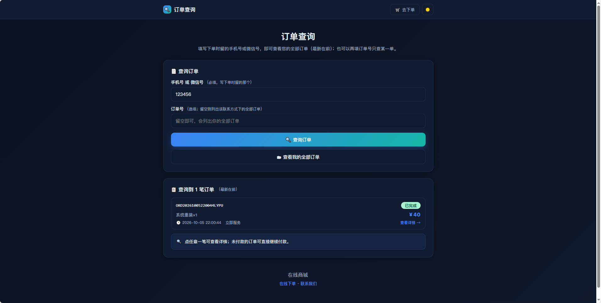

### 后台 · 订单与商品

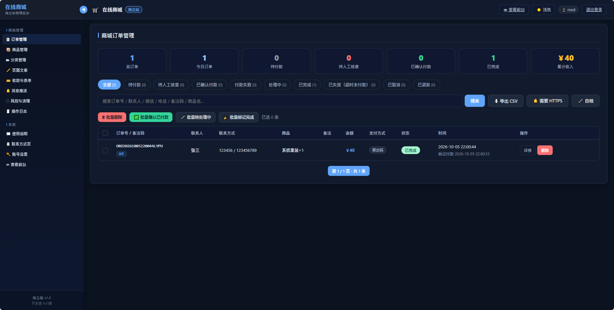

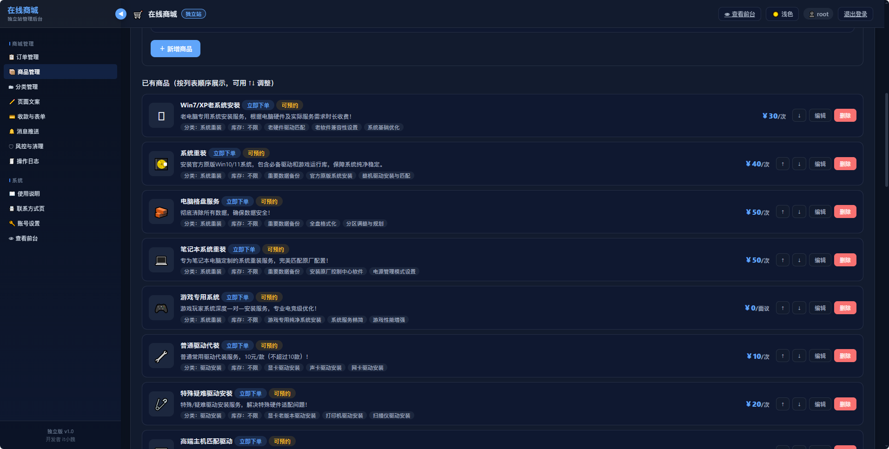

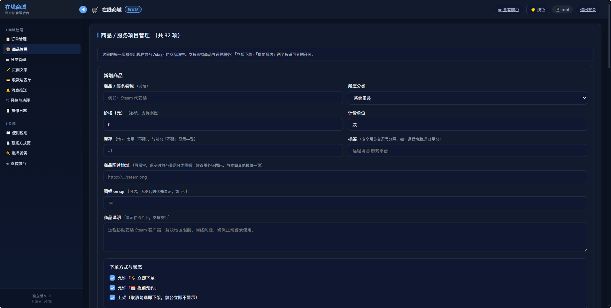

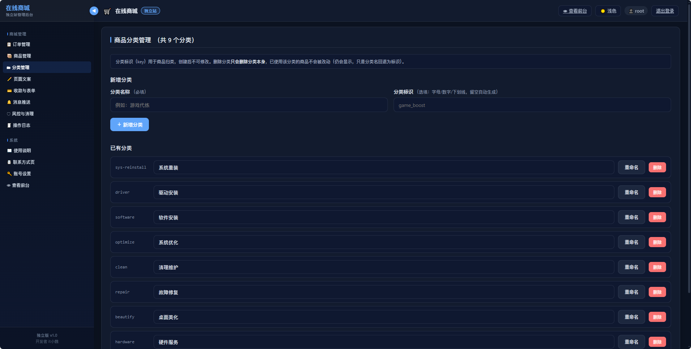

### 后台 · 收款与推送

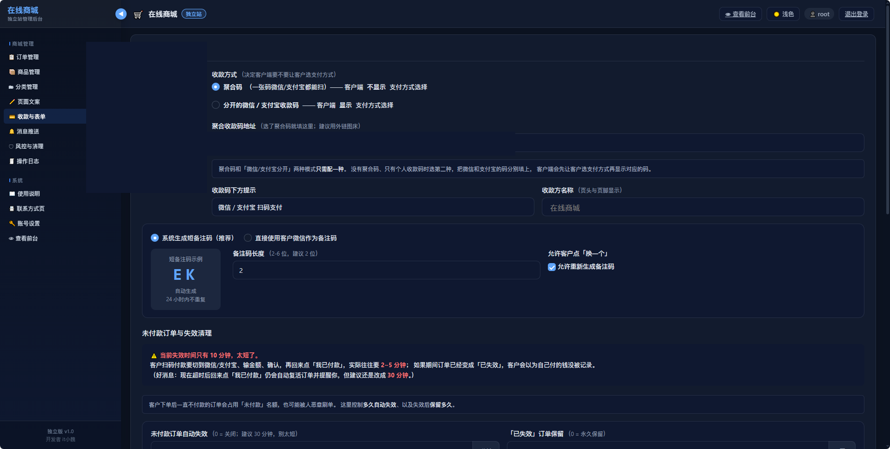

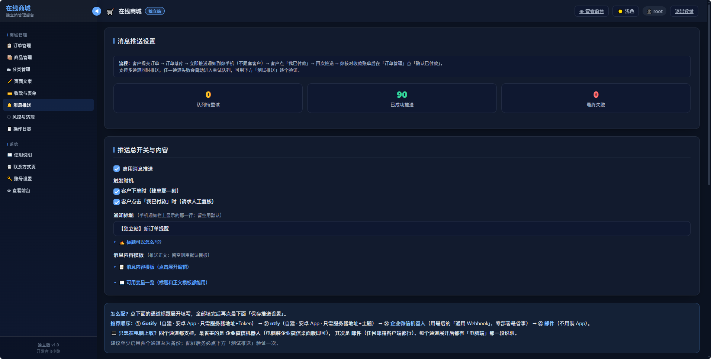

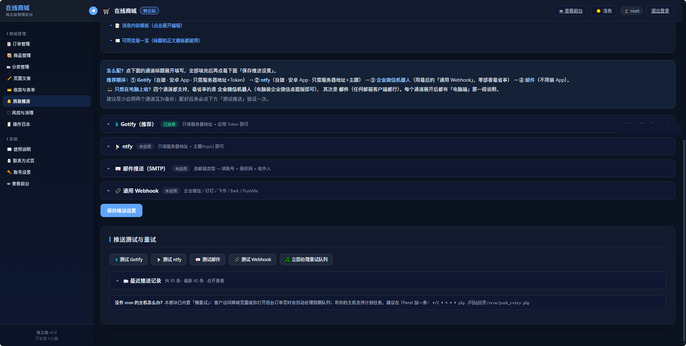

### 后台 · 风控与系统

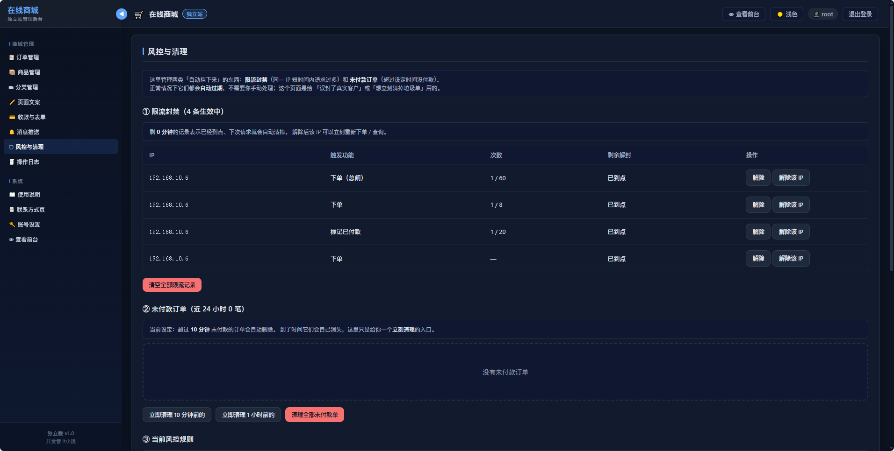

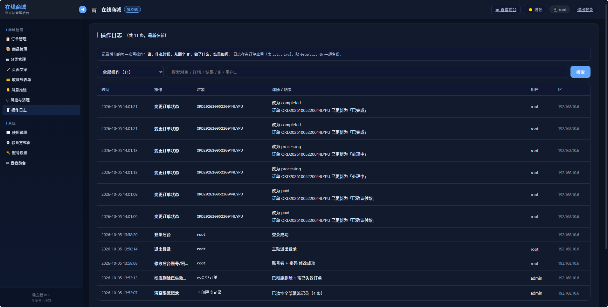

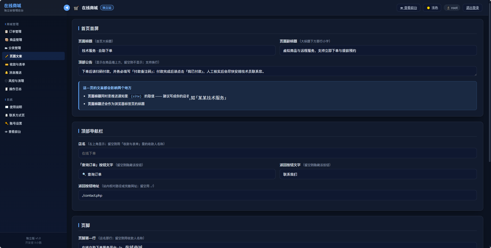

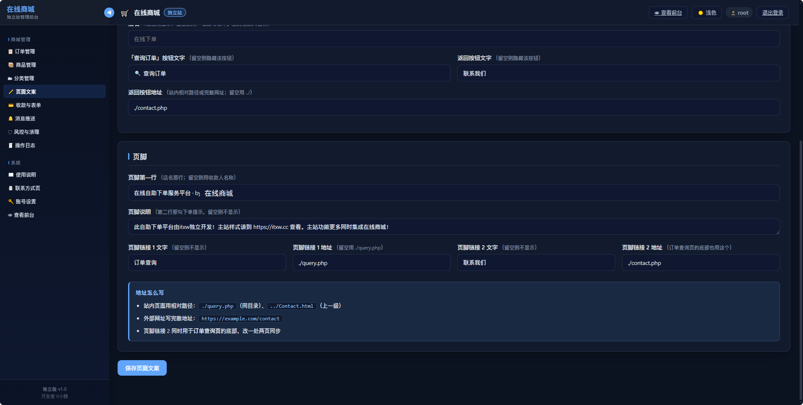

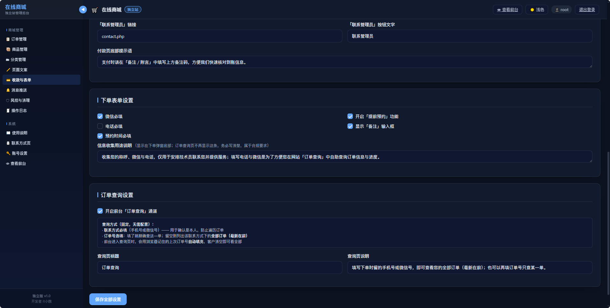

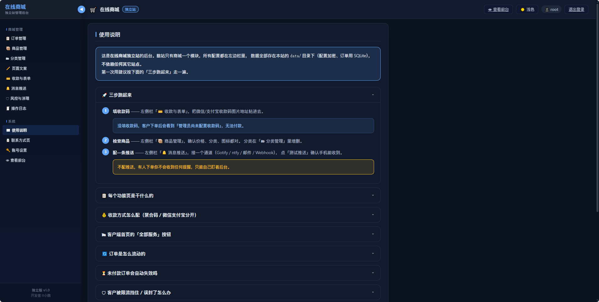

---

## 📦 环境要求

| 项目 | 要求 | 说明 |
|---|---|---|
| PHP | **7.4 或以上**（推荐 8.x） | 语法兼容 7.4 |
| 扩展 | **pdo_sqlite**（必须） | 订单功能依赖；缺了前台会提示「下单功能正在维护中」 |
| 扩展 | openssl（必须） | 数据加密 |
| 扩展 | mbstring（推荐） | 中文字数统计 |
| 扩展 | sockets（可选） | 只有「邮件推送 - 直连 SMTP」模式才需要 |
| 数据库 | **不需要** | 订单存本地 SQLite 文件，商品配置存加密 JSON |

> **1Panel 用户注意**：装完 PHP 后请确认已安装 **pdo_sqlite** 和 **sqlite3** 扩展（很多面板默认没装）。

---

## 🚀 快速开始（传统部署）

1. **上传**：把本项目所有文件上传到网站目录
2. **权限**：`chmod -R 755 data`（`secret/` 建议设为 600）
3. **配置访问保护**：
   - Apache：`.htaccess` 已内置，保持文件名不变即可（需开启 AllowOverride）
   - Nginx：需手动添加 deny 规则，片段见 [部署说明.md](部署说明.md) 第四节
4. **登录后台**：访问 `admin.php`，默认账号 `admin` / 密码 `admin888`
   ⚠️ 登录后请立即到「账号设置」修改；未修改时登录页和后台会持续提醒
5. **三步开店**：
   - 「收款与表单」配置收款码（不配客户无法付款）
   - 「商品管理」上架商品
   - 「消息推送」配置通知通道（不配只能手动看后台）
6. **（可选）计划任务**：每 5 分钟执行一次推送重试

   ```
   php /path/to/cron/push_retry.php
   ```

   不配置不影响下单，仅影响推送失败后的自动重试。

---

## 🐳 Docker 部署

> Docker 镜像与飞牛 fnOS FPK 支持正在开发中，完成后本节会更新一键部署命令。
> 当前请使用上方「快速开始」的传统部署方式。

---

## 📂 目录结构

```
在线商城独立服务站/
├── index.php            前台首页（分类展示 + 多选下单）
├── query.php            订单查询页
├── contact.php          联系方式页
├── api.php              下单 / 查询 / 标记付款接口
├── admin.php            管理后台（自带登录 + 使用说明）
├── inc/                 核心逻辑与后台视图
├── cron/                定时任务与环境自检
├── data/                ★ 数据目录（订单库 / 配置 / 账号，需保护）
├── secret/              ★ 加密密钥独立目录（需保护）
├── Readme-imgs/         README 截图
├── 部署说明.md           完整部署文档
└── 容器化与开源方案.md    容器化规划（开发中）
```

---

## ❓ 常见问题

- **前台提示「下单功能正在维护中」** → 服务器缺少 `pdo_sqlite` 扩展
- **收不到推送** → 在「消息推送 → 测试推送」里逐个通道验证；建议至少配置两个通道互为备份
- **忘记后台密码** → 删除 `data/account.php`，重新访问后台将恢复默认账号（恢复后请立即修改）
- **如何备份数据** → 备份 `data/` 和 `secret/` 两个目录即可

---

## ⚠️ 安全提醒

1. 默认账号密码务必第一时间修改
2. `secret/` 是配置加密密钥：**部署后不可更换**，否则历史加密配置无法解密；备份时与 `data/` 一起备份
3. 生产环境请按 [部署说明.md](部署说明.md) 第四节配置 Web 拒绝规则（Nginx 用户必做）

---

## 📜 开源协议

[MIT License](LICENSE)

---

欢迎 Issue / PR 反馈，也欢迎基于本项目做二次开发。